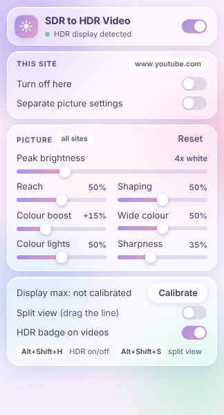
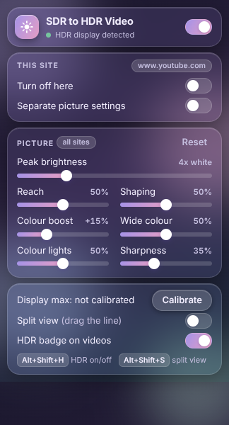

# SDR to HDR Video

A Chromium extension that converts ordinary (SDR) web video to HDR in real time on your GPU. It is a hand-tuned inverse tone mapper written as WebGPU shaders: no machine learning, no driver hooks, and nothing leaves your machine.

It is in the same spirit as Nvidia's RTX Video HDR, but works on any GPU that supports WebGPU. It was built and tuned on an AMD Radeon RX 9070 XT.

  
  

## Requirements

- Chrome, Edge, Brave or another Chromium browser, version 129 or newer
- A display running in HDR mode (on Windows: Settings > System > Display > Use HDR)
- A GPU with WebGPU support

Firefox is not supported: it has no HDR canvas output.

## Install

1. On this page click **Code > Download ZIP**, then unzip it. (Or clone the repository.)
2. Open `chrome://extensions` and turn on **Developer mode**.
3. Click **Load unpacked** and choose the unzipped folder, the one that contains `manifest.json`.
4. Play a video. An **HDR** badge appears in its top-right corner when the conversion is active.

To update, replace the folder's contents, click the reload arrow on the extension's card, and refresh any open video tabs.

## First-time setup: calibrate

The extension can't ask the browser how bright your display goes, so it has a calibration page.

1. Open the popup and click **Calibrate**.
2. Drag the slider right until the cross just disappears into the square.
3. Nudge it back until you can barely see the cross, then **Save**.

Until you calibrate, the extension assumes your display's maximum equals the **Peak brightness** slider. After calibrating, you can set Peak above your display's maximum and highlights will ease into it rather than clip.

If your monitor does its own tone mapping, the cross may never vanish completely. Pick the point where it becomes hard to see.

## Controls

### Picture

| Slider | Range | Default | What it does |
|---|---|---|---|
| Peak brightness | 1.5x to 12x | 4x | How bright the brightest highlights get, as a multiple of normal SDR white. |
| Reach | 0 to 100% | 50% | How far down the tonal range the brightening extends. Higher lifts more of the picture. |
| Shaping | Off to 100% | 50% | Gives big blown-out areas a gradient (dimmer rim, brighter middle) so they look like light instead of a flat patch. |
| Colour boost | Off to +50% | +15% | Extra saturation, reaching into the wider Display P3 gamut. Skin tones are mostly excluded. |
| Wide colour | Off to 100% | 50% | Stretches already-vivid colours out toward the edge of the P3 gamut. Muted colours, greys and skin stay put. |
| Colour lights | Off to 100% | 50% | Lets coloured highlights (neon, brake lights, fire) get a brightness boost closer to what white ones get. |
| Sharpness | Off to 100% | 35% | Contrast-adaptive sharpening. |

**Reset** restores the picture defaults.

### Per-site settings

When the popup is opened on a web page it shows that site's hostname with two switches:

- **Turn off here** disables the extension on that site only.
- **Separate picture settings** gives the site its own copy of the picture sliders. With it off, the sliders change the settings for all sites.

Embedded players follow the page they're embedded in, not the player's own domain.

### Other

- **Enabled** (top-right switch): master on/off for all sites.
- **Split view**: shows the original on the left and the HDR result on the right. Drag the line on the video to move it.
- **HDR badge on videos**: shows or hides the badge.

### Keyboard shortcuts

| Shortcut | Action |
|---|---|
| Alt+Shift+H | Turn HDR conversion on or off |
| Alt+Shift+S | Turn split view on or off |

Chrome may not assign these automatically when an unpacked extension is reloaded. Set or change them at `chrome://extensions/shortcuts`.

## What it won't convert

- **DRM-protected video** (Netflix, Disney+, Prime Video and similar). The browser does not let extensions read those frames.
- **Video that is already HDR.** It is detected and left alone.
- **Cross-origin video without CORS headers.** The browser blocks reading its frames.
- **Small videos** under 200 px wide, such as thumbnails and hover previews.
- **Pages that aren't served over HTTPS**, where WebGPU is unavailable.

## How it works

For each eligible `<video>`, the extension places a canvas exactly over it and redraws that canvas on every video frame. The canvas is a 16-bit float WebGPU surface in Display P3 with extended tone mapping, which is what lets pixel values above 1.0 show up brighter than SDR white.

Each frame goes through six shader passes:

1. **Analyse.** The frame is shrunk to 480x270, recording brightness, which pixels are highlights, and which are clipped (blown out).
2. **Shrink, three times,** down to 8x5. These small copies tell the main pass what the neighbourhood around each pixel looks like at several scales.
3. **Scene average.** One number for the whole frame's brightness, eased over about 0.7 seconds so the picture doesn't pump, and snapping faster on a scene cut.
4. **Convert.** The main pass, at full resolution. For every pixel it:
   - sharpens, backing off where there is already a strong edge;
   - debands, filling in the in-between shades that 8-bit video can't store, so smooth gradients don't show steps once stretched;
   - expands brightness. Shadows, midtones and skin are left alone; only the top of the range is pushed up. Small isolated highlights get the full peak, large bright areas get less than half, and bright scenes get less than dark ones;
   - shapes blown-out areas with a rim-to-centre gradient;
   - widens colour: vivid colours are stretched toward the P3 edge, and coloured lights get more of the brightness boost;
   - boosts colour, skipping skin tones;
   - rolls off anything brighter than the display can show.

### Where a neural net would go

There is no ML in this extension. If you want to add some, `expansionGain()` in `shader.js` is the one function that decides how much brighter each pixel gets. A small network that outputs a per-pixel gain map can replace it: write the map to a texture in its own pass, bind it in the main pass, and return the sampled value from `expansionGain()`.

## Known limitations

- **Bright text baked into the video** (burned-in subtitles, logos) is toned down but still brighter than ideal. Captions drawn by the site itself, such as YouTube's, are not affected.
- **White-background content** such as screen recordings may show a visible gradient near the edges of white areas. Lower **Shaping** or turn it off for that site.
- **Skin protection is by colour**, so wood, sand and other skin-coloured things also miss out on the colour boost.
- **Blown-out detail stays lost.** The extension shapes clipped areas but cannot recover what was in them.
- **Native fullscreen.** When a site fullscreens the bare video element with the browser's built-in controls, the bottom strip of the picture shows the unconverted video while those controls are visible.
- **Closed shadow roots** are searched through an extension-only browser API; this path has had little testing.

## Troubleshooting

| Problem | Likely cause |
|---|---|
| No HDR badge appears | HDR is off in your OS display settings, the video is DRM-protected or already HDR, or the extension is off for this site. The popup's status line reports a missing HDR display or WebGPU. |
| Picture looks washed out or far too bright | **Peak brightness** is above what your display can show and it hasn't been calibrated. Run **Calibrate**. |
| Faces look orange | Lower **Colour boost**. |
| Colours look neon or cartoonish | Lower **Wide colour** and **Colour lights**. |
| Halos or crunchy edges | Lower **Sharpness**, especially on low-bitrate video. |
| Shortcuts do nothing | Assign them at `chrome://extensions/shortcuts`. |
| Overlay is misaligned on one site | The site positions its video unusually. Use **Turn off here** for that site. |

Messages from the extension appear in the page's DevTools console, prefixed `[SDR to HDR]`.

## Permissions

- **Access to all sites**: the content script has to run on any page that might contain a video.
- **storage**: saves your settings locally. Nothing is synced or sent anywhere.
- **activeTab**: lets the popup read the current tab's hostname for per-site settings.

The extension makes no network requests.

## Files

| File | Purpose |
|---|---|
| `manifest.json` | Extension manifest (Manifest V3). |
| `content.js` | Finds videos, manages the overlay canvas, badge and split handle, and runs the render loop. |
| `shader.js` | All WGSL shader code. |
| `background.js` | Handles the keyboard shortcuts. |
| `popup.html`, `popup.js` | The settings popup. |
| `calibrate.html`, `calibrate.js` | The display calibration page. |
| `ui.css` | Shared styling for the popup and calibration page. |
| `icons/` | Extension icons, with their SVG sources. |
| `docs/` | Screenshots used in this README. |

## Testing status

The pipeline was verified numerically in headless Chromium with software rendering: synthetic test frames in, measured pixel values out, for every feature. It has been used on a real HDR display with an RX 9070 XT, but picture tuning on real footage is by eye and limited to that one setup. Other GPUs and displays may need different settings.

## License

[MIT](LICENSE)
