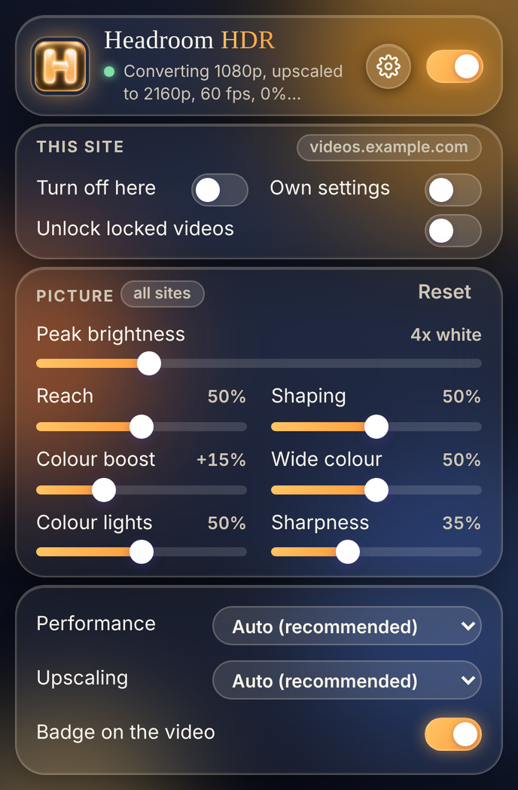
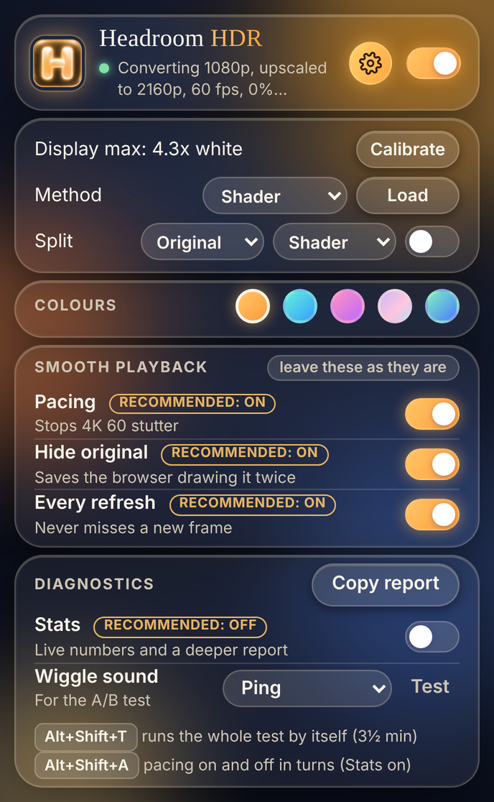
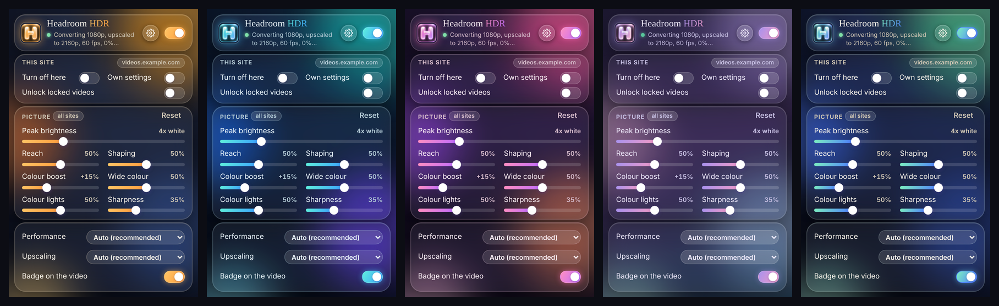

# Headroom HDR

(Called "SDR to HDR Video" before 0.11.) The name is the thing it uses: the brightness above white that an HDR display has to spare.

**The popup.** Picture controls up front. The cog opens settings: colour theme (Amber, Ocean, the old pastel Aurora, Match: one colour of your own with a second worked out to go with it, or Custom: two colours of your own), the three playback switches that are best left on (each says what is recommended), and diagnostics (Stats, Copy report, the wiggle sound, and the test keys).

The selected theme controls the popup colours and the generated highlight icon in its header and the browser toolbar. The browser's extensions list keeps the default icon.

A Chromium extension that converts ordinary (SDR) web video to HDR in real time on your GPU. It is a hand-tuned inverse tone mapper written as WebGPU shaders, with no driver hooks, and nothing leaves your machine. Optionally, a small model you train yourself on your own HDR movies can take over the brightness decisions.

It is in the same spirit as Nvidia's RTX Video HDR, but works on any GPU that supports WebGPU. It was built and tuned on an AMD Radeon RX 9070 XT.

  
  
   

## Requirements

- Chrome, Edge, Brave or another Chromium browser, version 129 or newer
- A display running in HDR mode (on Windows: Settings > System > Display > Use HDR)
- A GPU with WebGPU support

Firefox is not supported: it has no HDR canvas output.

## Install

1. On this page click **Code > Download ZIP**, then unzip it. (Or clone the repository.)
2. Open `chrome://extensions` and turn on **Developer mode**.
3. Click **Load unpacked** and choose the unzipped folder, the one that contains `manifest.json`.
4. Play a video. An **HDR** badge appears in its top-right corner when the conversion is active.

To update, replace the folder's contents, click the reload arrow on the extension's card, and refresh any open video tabs.

## First-time setup: calibrate

The extension can't ask the browser how bright your display goes, so it has a calibration page.

1. Open the popup, click the cog for the settings, and click **Calibrate**.
2. Drag the slider right until the cross just disappears into the square.
3. Nudge it back until you can barely see the cross, then **Save**.

Until you calibrate, the extension assumes your display's maximum equals the **Peak brightness** slider. After calibrating, you can set Peak above your display's maximum and highlights will ease into it rather than clip.

If your monitor does its own tone mapping, the cross may never vanish completely. Pick the point where it becomes hard to see.

## Controls

### Picture

| Slider | Range | Default | What it does |
|---|---|---|---|
| Peak brightness | 1.5x to 12x | 4x | How bright the brightest highlights get, as a multiple of normal SDR white. |
| Reach | 0 to 100% | 50% | How far down the tonal range the brightening extends. Higher lifts more of the picture. |
| Shaping | Off to 100% | 50% | Gives big blown-out areas a gradient (dimmer rim, brighter middle) so they look like light instead of a flat patch. |
| Colour boost | Off to +50% | +15% | Extra saturation, reaching into the wider Display P3 gamut. Skin tones are mostly excluded. |
| Wide colour | Off to 100% | 50% | Stretches already-vivid colours out toward the edge of the P3 gamut. Muted colours, greys and skin stay put. |
| Colour lights | Off to 100% | 50% | Lets coloured highlights (neon, brake lights, fire) get a brightness boost closer to what white ones get. |
| Sharpness | Off to 100% | 35% | Contrast-adaptive sharpening. |

**Reset** restores the picture defaults.

### Using a trained model

The shader decides how bright each part of the picture gets with hand-written rules. A model trained with HDR Trainer (a separate program) learns the same thing by comparing real HDR movies with their SDR versions, and can be used two ways. **Guided** (what loading a model switches on): the shader still decides how much brighter highlights get, and the model decides where, telling lights from things that are merely white, which the shader can only guess at from the size of a bright area. **Your model**: the model makes the whole decision. That is truer to how films are graded and much tamer: it is trained to be right on average, so it hedges everywhere but on pure white.

1. In HDR Trainer, click **Export model**. It writes `hdr-trainer/workspace/export/hdr-model.json`.
2. In the popup's settings (the cog), click **Load** next to **Method**, then **Choose model file** and pick that file.
3. The extension switches to Guided straight away. Videos already playing pick it up within a second, and the badge reads **HDR · GUIDED**. Split view is set to Shader | Guided, so switching Split on shows what the model changes. **Method** (in the settings) chooses between Shader, Guided and Your model.

To load a newer export, do the same again; it replaces the old one. **Remove model** on that page goes back to shader only.

Comparing the two:

- **Method** in the popup's settings switches between **Shader**, **Guided** and **Your model**. **Alt+Shift+M** goes round the three from the keyboard, which is the quickest way to flip back and forth on the same scene.
- **Split** shows two pictures at once, one each side of a line you can drag. Its two menus pick what each side shows: **Original**, **Shader**, **Guided** or **Model**. Set them to Shader and Guided to see what the model changes, to Shader and Model to put those two side by side, or to Original and Model to see the model against the untouched video.

What changes while the model is in use:

- **Reach**, **Shaping** and **Colour lights** do nothing. They tune the shader's own brightness rules, so they are greyed out whenever the shader isn't on screen.
- **Peak brightness** becomes a ceiling. The model isn't limited by it, so its highlights ease into Peak, or into your display's calibrated maximum if that is lower.
- Colour boost, Wide colour, Sharpness, debanding and everything else work as before.
- The model can make parts of the picture darker than the original as well as brighter. The shader never darkens.

How good it looks depends entirely on the model. One trained on a single movie will be rough; that is expected.

The model runs once per video frame on a small copy of the picture, as GPU compute shaders. It is extra work on top of the shader, and the **Performance** setting does not reduce it. If video stutters with the model on and not with the shader, the GPU can't fit it in.

### Per-site settings

When the popup is opened on a web page it shows that site's hostname with three switches:

- **Turn off here** disables the extension on that site only.
- **Unlock locked videos** is for sites where the popup reports a locked video; see the next section.
- **Own settings** gives the site its own copy of the picture sliders. With it off, the sliders change the settings for all sites.

Embedded players follow the page they're embedded in, not the player's own domain.

### Unlocking locked videos

On some sites nothing gets converted and the popup says "A video here is locked against reading". The video file is coming from a different server than the page, and that server hasn't said the page may read it. The browser will still play such a video, but refuses to hand its pixels to anything, this extension included.

Switching on **Unlock locked videos** for that site adds the missing permission to video the site loads, then reloads the video so it takes effect. Your place in the video, the speed and whether it was playing are kept. If the video won't load that way, it is put back as it was and stays unconverted.

What you are agreeing to when you switch it on: on that site, the page's own scripts gain the same ability to read the video that the extension gets. For a site you'd watch video on anyway that is rarely a concern, but it is why this is off by default and set per site. It affects video and audio requests made by that site's own pages, in the tab where a video needed it, and nothing else: a frame from another site inside the page (an advert, an embedded player) is not given it, which also means a locked video inside such a frame stays locked. It lasts until the tab or the browser is closed, and is removed as soon as you switch it off.

It does not work on DRM-protected video; nothing does.

### Other

- **Enabled** (top-right switch): master on/off for all sites.
- **Upscaling**: how a video with fewer pixels than your screen is made bigger. **Off** leaves it to the browser, which is soft. **Fast** is an edge-aware upscale in the style of AMD FSR 1. **Best** is FSRCNNX, the small trained network mpv users know (by igv): it doubles the picture, costs the GPU far more, and is used where the picture is made at least 1.3 times bigger. **Auto** (the default) uses Best at any frame rate, and with Performance on Auto steps down by itself if the GPU's own timing says it can't fit it in (the smaller size of the network, then Fast, then off); the next video on the page starts where the last one ended up. In a browser that doesn't let the GPU be timed, Auto keeps Best for video under 45 frames a second. With Performance on Best quality the bigger network is always used; with Fastest, upscaling is off.
- **Smooth motion** (Off by default): for video with fewer frames than your screen has refreshes (30, 25 or 24 frames a second on a 60 Hz screen), the pictures between two frames are made up from the motion in the video, so every refresh shows something new and movement looks smoother. It works out where things moved between each pair of frames and slides the pixels part of the way; where that fails (a cut, something uncovered, movement too fast to follow) it shows the nearer real frame instead, so a failure looks like the old judder and not a smear. Costs: the picture runs one video frame behind the sound (about 33 ms at 30 frames a second); fast action, hair, fences and moving text can smear or wobble; the GPU draws a picture every refresh, so a 30 fps video costs about what a 60 fps one does. It needs **Every refresh** on, and it is used only while the video's frame rate is well under the screen's refresh rate. Before it is first used on a GPU it checks itself on a made-up pair of frames with a known motion, and if the result is wrong it is not offered; if it turns out too slow for the GPU it stops by itself and the report says so. With **Stats** on, **Alt+Shift+I** goes round three views for judging it: the picture, where it fell back to the nearer real frame (in red), and the motion it found.
- **Performance**: how hard the extension works your GPU.
  - *Auto* (default) draws anything up to 4K at 60 frames a second at full size, and 4K at 120 at 1440p, scaled up. From there it goes by how long a frame's drawing actually takes the GPU, which it measures now and then: if that is more than half the time between two frames it steps down, to 1440p and then to 1080p with sharpening and debanding off. If frames are being lost while the GPU has time to spare, lower quality can't help, so it is left alone and the popup says the frames are being lost outside the GPU. In a browser that can't time the GPU, it steps down when frames are dropped for two measurements in a row (about six seconds). Steps that would change nothing on your screen are skipped. It starts afresh for each new video.
  - *Best quality* always renders at your screen's resolution with everything on.
  - *Fastest* always renders at 1080p with sharpening and debanding off.
- **Hide original** (on by default): makes the original video invisible while the overlay is covering it. The browser otherwise goes on preparing the original for the screen as well, which takes frames the video decoder needs: with it showing, the player's controls appearing made the decoder drop frames for seconds at a time (measured on YouTube at 4K 60: 134 hitches in 52 seconds with it showing, 3 in 26 with it hidden). The video keeps playing, keeps its place on the page and still takes clicks, and it is made visible again the moment drawing fails or the extension is switched off. It isn't applied to a video that uses the browser's built-in controls. If a video ever goes black, switch this off.
- **Every refresh** (on by default): looks at the video on every refresh of your display and draws whenever the frame it is showing has changed. The browser also announces each new frame, and drawing used to rely on that alone, but the announcement can come a refresh late, and by then that frame has been replaced by the next and is lost. Each new frame is first copied into a short queue (three copies are kept), and one is put on screen per refresh, in order, so a frame that turns up a moment late still gets its turn instead of being skipped. Nothing is drawn twice: a refresh with no new frame costs one cheap look. Switch it off only to find out whether it is causing a problem; drawing then relies on the browser's announcements alone.
- **Pacing** (on by default; Windows only, and only for video of 45 frames a second or more): has the browser hand each redraw of the page to Windows about 5 ms into the screen refresh instead of right at its start, where that hand-over can get stuck and make 4K 60 video stutter (see "Performance" under "How it works"). It runs in a worker of its own and costs the page nothing. Switch it off only to find out whether it is causing a problem.
- **Method** (in the settings): what decides the brightness: the built-in **Shader**, **Guided** (the shader, with your model saying where the lights are) or **Your model**. See "Using a trained model". The button next to it loads, replaces or removes a model.
- **Split**: split view. The switch turns it on; the two menus choose what is shown left and right of the line: **Original** (the untouched video), **Shader**, **Guided** or **Model** (the last two need a loaded model). Any pairing works, for example Original and Shader, Shader and Model, or Model and Original. Drag the line on the video to move it. Changing **Method** also puts the new method on the right-hand side, so the split keeps comparing against what you are using until you choose otherwise.
- **Badge**: shows or hides the HDR badge.
- **Stats**: turns the badge into a live readout that stays visible, so it can be read in fullscreen where the popup can't be opened. For example `HDR · 60 fps · 0% dropped · longest gap 18 ms · 3440x1440 · drawing: queue · original invisible`: new video frames drawn per second, the share of the video's frames that were never drawn, the longest wait between two frames, the size drawn at, how frames are being drawn, and whether the original is hidden. The numbers refresh about every three seconds and read "measuring" until the first clean stretch of playback.

- **Report**: copies a diagnostic report for the current tab to the clipboard, for pasting into a bug report. It is recorded all the time, so you can click it after a problem has happened. Nothing is sent anywhere; it only goes to your clipboard. It holds:
  - your browser, screen, settings and the site's name (not the page address), and whether the extension, HDR and WebGPU are available on that page;
  - every video on the page, with its size and state, and either "CONVERTING" or the reason it is not being converted (too small, already HDR, DRM, unreadable, no frame yet, extension off, and so on);
  - for each video being converted, one line for every three seconds of the last few minutes: frames drawn, frames dropped, the longest gap, how late the page was told about frames, how long drawing took, how long the GPU took, how busy the page was (two measures: time stuck in long tasks, and how late a regular timer ran), and what the video was doing (buffering, changing quality);
  - a history of what the extension did on that page: videos found, conversions started and stopped and why, errors, quality changes. The last 150 entries are kept, until the page is reloaded.

  If the extension didn't engage on a video, click **Report** while you are still on that page, before reloading.

### Keyboard shortcuts

| Shortcut | Action |
|---|---|
| Alt+Shift+H | Turn HDR conversion on or off |
| Alt+Shift+S | Turn split view on or off |
| Alt+Shift+M | Go round the methods: shader, guided, model (needs a loaded model) |

Chrome may not assign these automatically when an unpacked extension is reloaded. Set or change them at `chrome://extensions/shortcuts`.

## What it won't convert

- **DRM-protected video** (Netflix, Disney+, Prime Video and similar). The browser does not let extensions read those frames.
- **Video that is already HDR.** It is detected and left alone. A switch between an SDR and an HDR stream in the middle of a video can take about five seconds to notice.
- **Locked video, unless you unlock it.** Some sites serve their video from another server that doesn't permit it to be read, and the browser then blocks reading its frames. The popup says when this is the case, and **Unlock locked videos** can usually get round it; see below.
- **Small videos** under 200 px wide, such as thumbnails and hover previews.
- **Pages that aren't served over HTTPS**, where WebGPU is unavailable.

## How it works

For each eligible `<video>`, the extension places a canvas exactly over it and redraws that canvas on every video frame. The canvas is a 16-bit float WebGPU surface in Display P3 with extended tone mapping, which is what lets pixel values above 1.0 show up brighter than SDR white.

With the shader method, each frame goes through seven shader passes:

1. **Copy.** The video frame is copied into an ordinary texture. Reading straight from a video is costly (two planes to fetch and a colour conversion each time), and the main pass reads nine video pixels for every pixel it draws, so this is done once here and everything after reads the copy.
2. **Analyse.** The frame is shrunk to 480x270, recording brightness, which pixels are highlights, and which are clipped (blown out).
3. **Shrink, three times,** down to 8x5. These small copies tell the main pass what the neighbourhood around each pixel looks like at several scales.
4. **Scene average.** One number for the whole frame's brightness, eased over about 0.7 seconds so the picture doesn't pump, and snapping faster on a scene cut.
5. **Convert.** The main pass, at full resolution. For every pixel it:
   - sharpens, backing off where there is already a strong edge;
   - debands, filling in the in-between shades that 8-bit video can't store, so smooth gradients don't show steps once stretched;
   - expands brightness. Shadows, midtones and skin are left alone; only the top of the range is pushed up. Small isolated highlights get the full peak, large bright areas get less than half, and bright scenes get less than dark ones;
   - shapes blown-out areas with a rim-to-centre gradient;
   - widens colour: vivid colours are stretched toward the P3 edge, and coloured lights get more of the brightness boost;
   - boosts colour, skipping skin tones;
   - rolls off anything brighter than the display can show.

### Smooth motion

With Smooth motion on, a video with fewer frames than the screen has refreshes gets pictures made up between its frames (`interp.js`). For each new frame B, with the frame before it A:

1. B is shrunk to 480x270, 120x68 and 30x17 (luminance only), by the same passes the analysis uses.
2. **Motion** is found by block matching, coarse to fine: every shift up to 3 texels at 30x17, then only shifts close to what the level above found at 120x68 and 480x270, with a parabola fitted for the part of a pixel. The result is, for each pixel of B, where it was in A.
3. For each refresh between the two frames the picture is made from A and B each slid part of the way along that motion and blended. Where the two disagree (the match was wrong, something was uncovered), or the frame as a whole did not match (a cut), the nearer real frame is used as it is, so a failure shows as the old judder and not as a smear.

The picture then goes through the rest of drawing as if it were a video frame: analysis, upscaling, the conversion to HDR. A steady clock of its own (not the arrival of frames, which land on the grid of refreshes) says when each pair begins, so the video moves the same amount every refresh. At 30 frames a second on a 60 Hz screen the first refresh of each pair is the real frame and the second is the picture halfway.

The motion is worked out once per video frame; per refresh there is one mixing pass and the usual drawing. Before it is used on a GPU, a made-up pair of frames with a known motion goes through the same code and the result is checked; if it is wrong, smooth motion is not offered there. If working out the motion takes the GPU most of a frame's time it stops by itself. Turning it off and on in the popup tries again.

### Performance

The extension draws from the page's own scripting thread. While a video plays it looks at it on every refresh of the screen; a frame it hasn't seen is copied into a texture of its own and queued, and one queued frame is put on screen per refresh.

Three things can make it miss frames, and the report tells them apart:

- **The page being busy.** If the page's own scripts hold the thread for longer than a frame, nothing can be drawn in that time. Players do this briefly when their controls appear and disappear.
- **The GPU's workload.** A frame's drawing takes well under a millisecond on a current desktop card, even at 4K, so this only matters on slow graphics hardware. Auto measures it and lowers the render size if it has to.
- **The browser's screen queue getting stuck.** This was the cause of nearly all the stutter found while testing, and it has nothing to do with how hard the GPU is working. With the extension off, a fullscreen video goes to the screen on a path of its own. With it on, the browser redraws the whole page for every frame, because the picture is now a canvas on the page. A browser trace (Brave on Windows, 4K 60 on YouTube) showed what goes wrong: normally each redraw is handed to Windows in about 0.1 ms, but once one is handed over late (the player's controls coming up, going fullscreen, any hiccup) the next has to wait for the following screen refresh, about 15 ms, and so does every one after it, for as long as there is something to draw every refresh. That wait happens on the one thread in the browser's GPU process that also runs the video decoder and WebGPU, which are left about a tenth of their time: decoding takes several times as long, frames are thrown away for being late, the player stalls. It ends by itself only at the first refresh in which the page has nothing to redraw, which with a 60 fps video playing can be a long time coming. So the extension makes that refresh: when a frame handed to the GPU is still waiting after five frame times though the GPU has little to do, or the decoder shows trouble, it holds the page for a little over three refreshes ("holding a beat", about 55 ms at 60 Hz), which lets the queue empty. That costs a freeze of about four refreshes, once. From the same moment every other frame of the video is let go by, until the decoder has been well for a little over half a second: a second trace showed the queue filling again right after a beat, as the decoder caught up, unless the redraws were thinned out for that moment. The picture runs at half the frame rate for that time, usually about a second. If the mouse has just been moved it stays at half rate until the player's controls have gone again, because the player redraws the page every refresh while they show. The original video is also hidden while converting, so the browser isn't preparing its frames for the screen as well.

  That is the cure. **Pacing** is an attempt at not needing it. The browser's own source shows why one late hand-over is enough: the page is drawn into a pair of buffers, one on screen and one being handed over, so a second hand-over has nowhere to go until Windows has taken the first. Left to itself the browser hands a redraw over about 0.8 ms after each screen refresh, the very moment Windows is taking the last one, and in both traces every hand-over that got stuck was one made at that moment; in the one stretch where the page's redraws happened to reach the browser about 5 ms into each refresh, 36 seconds of it, nothing got stuck at all. So a worker makes that the rule. The browser, before it draws a refresh, waits a while for everything on the page that has been told a refresh has begun and hasn't answered; a canvas drawn from a worker is such a thing, even one that is never put on the page; so the worker draws a dot into one, sleeps until 5 ms into the next refresh, and only then lets its answer go. The browser draws the moment it has the answer. A canvas that isn't on the page gives it nothing to redraw, so nothing is drawn that wouldn't have been. And if the hand-over gets stuck all the same, one that starts 6 ms into the refresh keeps the browser's GPU thread waiting for 10 ms of every 17 instead of 16, which leaves the decoder room. Whether it does keep the hand-over from getting stuck has to show on the machine: the report counts beats and dropped frames separately for pacing on and off.

### Tracking down stutter

The **Report** button copies a plain-text report for the tab. For every video it has a line per three seconds of playing (frames drawn, dropped, GPU time, decoder drops, how busy the page was) and a **hitch log**: one line for each time a frame of the video was lost or stayed on screen too long, with what else was going on at that moment (the page busy, the GPU behind, the decoder dropping frames, the picture size changing) and the likeliest cause.

With **Stats** switched on the report goes deeper. The GPU is timed on every frame, the page's own screen updates are watched (if those are late too, the trouble is outside the video), and a video that is *not* being converted is measured the same way. That gives a like-for-like test:

1. Switch Stats on, and the extension off. Reload the page and play the video for 30 seconds.
2. Reload, switch the extension on, and play the same 30 seconds in the same window size.
3. Click Report. It holds both runs and a table setting them side by side.

With Stats on, runs are kept across a reload of the page for half an hour, so the one report at the end has both.

Four keys work while Stats is on, including in fullscreen, and the report counts hitches separately for each setting they switch between: **Alt+Shift+O** switches Hide original, **Alt+Shift+P** switches Every refresh, and **Alt+Shift+A** starts or stops a test that switches Pacing off and on in 30-second turns. **Alt+Shift+I** goes round the views for judging Smooth motion (see above); it changes nothing that is saved.

On Windows (or anywhere with Stats on), while a video of 45 frames a second or more is being converted, the browser's GPU thread is asked directly, and a beat is held as soon as it shows the hand-over stuck: a worker puts a question to the browser's GPU process that takes no work to answer, about thirty times a second, and times the answer. The answer has to come from the one thread that also hands redraws to Windows, so while a hand-over is stuck the answer arrives with the next screen refresh and not before. The report says how often that happened with pacing on and off, lists each time the hand-over was stuck (when, for how long, and how soon a beat followed), and has a small table of how long the answer took at each moment of the refresh, which shows at what moment the browser is busy handing over.

With Upscaling off it never draws the picture with more pixels than the video has (unless Performance is set to Best quality); the browser scales the smaller picture back up to fit. With Upscaling on, a smaller video is drawn with as many pixels as the screen has, and an extra pass between the scene average and the main pass does the scaling up with regard for edges (the upscaling half of AMD's FidelityFX Super Resolution 1, under its MIT licence: see `LICENSE-FSR.txt`).

The extension also keeps its background work light while a video plays: looking for new video players happens in the browser's idle time, and the check for an HDR stream happens every few seconds.

### How the trained model fits in

`expansionGain()` in `shader.js` is the one function that decides how much brighter each pixel gets. With a model loaded and selected, that decision comes from the model instead, and the rest of the main pass is unchanged.

The model is a small convolutional network (about 52,000 weights). Each video frame is shrunk to 480x270 and run through it in a preparation step and eleven compute-shader passes (`model.js`). The network's picture is always 16:9; a video of another shape sits in it with black bars, unstretched, which is how the trainer showed it such films. It does not output a picture. It outputs a 120x68 map of brightness curves: at each spot, four numbers giving the gain for pixels of four brightness levels. The main pass reads each pixel's gain from the curve at its position, so the per-pixel cost is one extra texture read.

The curves are eased over about a tenth of a second so the picture doesn't flicker from frame to frame; where they change a lot at once, as at a scene cut, the new value is used straight away.

## Known limitations

- **Bright text baked into the video** (burned-in subtitles, logos) is toned down but still brighter than ideal. Captions drawn by the site itself, such as YouTube's, are not affected.
- **White-background content** such as screen recordings may show a visible gradient near the edges of white areas. Lower **Shaping** or turn it off for that site.
- **Skin protection is by colour**, so wood, sand and other skin-coloured things also miss out on the colour boost.
- **Blown-out detail stays lost.** The extension shapes clipped areas but cannot recover what was in them.
- **Native fullscreen.** When a site fullscreens the bare video element with the browser's built-in controls, the bottom strip of the picture shows the unconverted video while those controls are visible.
- **Closed shadow roots** are searched through an extension-only browser API; this path has had little testing.

## Troubleshooting

| Problem | Likely cause |
|---|---|
| Video stutters | Open the popup while it plays. The line under the title shows the frame rate and the share of frames dropped; hover it for the render size and which GPU is in use. Try **Performance: Fastest**. On a laptop with two GPUs, Chrome on Windows uses one for everything, usually the integrated one: set Chrome to "High performance" in Windows graphics settings, or enable `chrome://flags/#force-high-performance-gpu`, and restart it. If the status line says "busy page", lowering quality made no difference: the page itself is keeping the extension from drawing on time, and a lower video resolution is the remaining option. |
| Stutter at 4K 60, worst in fullscreen, in the first seconds of a video or when the player's controls appear | The browser's screen queue getting stuck (see "Performance" under "How it works"). Check that **Hide original**, **Every refresh** and **Pacing** are all on. The extension clears it by itself when it sees it, by holding the page for a moment. If it keeps happening, the video's own 1440p setting is the dependable way out. Switch on **Stats**, play for a couple of minutes, click **Report** and paste the result into a bug report: it lists each time the extension held a beat or eased off, and whether that cleared it. |
| The popup says a video is locked | Switch on **Unlock locked videos** for that site. If it then says the video couldn't be unlocked, that site's server refuses, and the video can't be converted. |
| The popup says the extension isn't running on this page | The page was already open when the extension was installed, updated or reloaded. Refresh the page. (A few pages, such as the Chrome Web Store, never allow extensions.) |
| No HDR badge appears | HDR is off in your OS display settings, the video is DRM-protected or already HDR, or the extension is off for this site. The popup's status line reports a missing HDR display or WebGPU. To find out which, click **Report** in the popup while on that page: the copied text names the reason for each video. |
| Picture looks washed out or far too bright | **Peak brightness** is above what your display can show and it hasn't been calibrated. Run **Calibrate**. |
| Faces look orange | Lower **Colour boost**. |
| Colours look neon or cartoonish | Lower **Wide colour** and **Colour lights**. |
| Halos or crunchy edges | Lower **Sharpness**, especially on low-bitrate video. |
| Stutter only with the model on | The model is extra GPU work on every video frame, and Performance doesn't reduce it. Switch **Method** back to **Shader**. |
| "Your model" can't be selected | No model is loaded. Click **Load** next to Method. |
| The model page rejects the file | Choose `hdr-model.json` from HDR Trainer's `workspace/export` folder. A message about a newer trainer means the extension needs updating. |
| Shortcuts do nothing | Assign them at `chrome://extensions/shortcuts`. |
| Overlay is misaligned on one site | The site positions its video unusually. Use **Turn off here** for that site. |

Messages from the extension appear in the page's DevTools console, prefixed `[Headroom HDR]`.

## Permissions

- **Access to all sites**: the content script has to run on any page that might contain a video.
- **declarativeNetRequestWithHostAccess**: used only by **Unlock locked videos**, and only on sites where you switch that on, to add the response headers that let a video be read.
- **storage**: saves your settings, and a trained model if you load one, locally. Nothing is synced or sent anywhere.
- **One page any site may load** (`pacer.html`, a web-accessible resource): the frame that pacing runs in has to be loadable inside the page being watched. It holds nothing and does nothing but pace that page's own drawing; a site could tell from it that the extension is installed.

The extension makes no network requests.

## Files

| File | Purpose |
|---|---|
| `manifest.json` | Extension manifest (Manifest V3). |
| `content.js` | Finds videos, manages the overlay canvas, badge and split handle, and runs the render loop. |
| `shader.js` | The WGSL code for the shader pipeline. |
| `model.js` | Checks a trained model file and runs it on the GPU. |
| `diag.js` | The measuring behind the Report button: the hitch log, and the deeper checks that Stats switches on. |
| `pacer.js` | The page's side of pacing (having the browser draw a few milliseconds into each refresh) and of asking the browser's GPU thread while Stats is on: makes the frame below, tells its workers what to do, keeps what they report. |
| `cue.js` | The sound that says when to wiggle the mouse during the A/B test, and the popup's Test button for it. |
| `pacer.html`, `pacer-frame.js` | The extension's own frame, one dot big and see-through, put into a page that is converting fast video. Its workers can't be started from the page itself on sites like YouTube. |
| `pacer-worker.js` | The four workers in that frame: one paces, one asks the GPU thread, one keeps time for those two, one keeps the browser's timers fine. |
| `model.html`, `model-page.js` | The page for loading or removing a trained model. |
| `background.js` | Handles the keyboard shortcuts, the header rules for unlocking videos, the colouring of the toolbar icon, and hands the FSRCNNX files to the page that asks for them. |
| `theme.js` | The colour themes (Amber, Ocean, Aurora, Match, Custom): puts the chosen one on every extension page and colours the popup's logo. Its colour maths is repeated in `background.js` for the toolbar icon; keep the two in step. |
| `popup.html`, `popup.js` | The settings popup. |
| `calibrate.html`, `calibrate.js` | The display calibration page. |
| `ui.css` | Shared styling for the popup, the calibration page and the model page. |
| `icons/` | The packaged icon in four sizes, and its SVG artwork. The toolbar icon and the popup's logo are recoloured from it for the chosen theme as they are drawn. |
| `CHANGELOG.md` | What changed in each version. |
| `PRIVACY.md` | The privacy policy: nothing is collected or sent. |
| `upnet.js` | Reads the FSRCNNX shader files and turns their passes into WGSL, for the Best level of Upscaling. |
| `interp.js` | Smooth motion (frame interpolation): the block-matching and mixing shaders, the clock that decides which picture goes on each refresh, and the check it runs on itself before it is used. |
| `third_party/fsrcnnx/` | The FSRCNNX shader files by igv, unchanged, under the LGPL 3 (their licence texts are beside them). Not under the MIT licence of the rest. |
| `LICENSE-FSR.txt` | The licence of AMD's FidelityFX Super Resolution 1, which the upscaling pass is a port of. |
| `docs/` | Screenshots used in this README. |
| `tests/` | Checks that run in headless Chromium or plain Node (see `tests/README.md`). Not part of the extension. |

## Testing status

The pipeline was verified numerically in headless Chromium with software rendering: synthetic test frames in, measured pixel values out, for every feature. It has been used on a real HDR display with an RX 9070 XT, but picture tuning on real footage is by eye and limited to that one setup. Other GPUs and displays may need different settings.

Smoothness was worked out on that same machine, in Brave on Windows 11, with 4K 60 fps video on YouTube in fullscreen, from the extension's own diagnostic reports. Headless Chromium can't stand in for that: its software GPU is too slow to play video in real time. So how smooth playback is on other hardware, other browsers and other sites is not known.

Pacing was checked in headless Chromium on Linux with browser traces: the browser's drawing moved from 0.1 ms to between 5 and 6 ms into each refresh and back when switched; a page with nothing to redraw stayed undrawn; an answer that came too late cost that one refresh the wait and nothing after it; a worker that hung was ignored by the browser after ten refreshes; and on a page that forbids workers and frames it runs all the same, from the extension's own frame; with sleeps made to run over, it doesn't start and says why. A made-up stuck hand-over was recognised by the worker that asks the GPU thread, with the right moment in the refresh. What none of that can show is the thing it is for: whether a later hand-over keeps Windows from getting stuck. That had not been run on Windows when this was written, and neither had the two things 0.10.11 does for Windows alone (keeping the frame's process out of the background, and keeping its timers fine): those were read out of the browser's source.

The trained-model path was checked the same way: fed a real video frame, the GPU version of the network gives the same numbers as the PyTorch original (to within 0.000001) on a random model; models with known answers produce the expected brightness on screen, including at the right place in the picture for a video that isn't 16:9. Failures were also injected on purpose (while starting, while drawing, and unreadable frames) to check that conversion recovers. How a real trained model looks, and how fast it runs on real hardware, had not been checked when this was written.

Smooth motion was checked in headless Chromium on a software GPU with made-up frames whose motion is known (`tests/`): the motion found is within about a third of a pixel, the picture made halfway is within about 0.1 to 0.8% of the true one, and a cut falls back to the nearer frame exactly. Its timing logic was checked against pretend screens of 60, 75, 120 and 144 Hz and video of 30, 25, 24 and 23.976 frames a second. What none of that can show is how it looks on real video (smearing on fast action, grain mistaken for motion, how the cut thresholds behave on real footage), how fast it is on a real GPU, and how the one-frame delay against the sound feels. None of it has been run on a real display.

## License

[MIT](LICENSE), except the two FSRCNNX shader files in `third_party/fsrcnnx/`, which are igv's and under the LGPL 3 (see the README there). The Fast upscaling pass is a port of AMD's FidelityFX Super Resolution 1, used under its MIT licence (`LICENSE-FSR.txt`).
